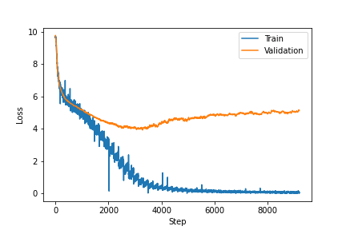

# Transformer (Attention Is All You Need)

A PyTorch implementation of transformer ([Attention Is All You Need](https://arxiv.org/abs/1706.03762) - Google Brain, 2017).  
I used [Korean chatbot dataset](https://github.com/songys/Chatbot_data) to train my transformer model. 

### Dataset
The Korean chatbot dataset has 11823 Q&A pairs.  
| Questions | Answers |
| --- | --- |
| 12시 땡! | 하루가 또 가네요.|
| 1지망 학교 떨어졌어 | 위로해 드립니다. |
| 3박4일 놀러가고 싶다 | 여행은 언제나 좋죠. |
| 3박4일 정도 놀러가고 싶다 | 여행은 언제나 좋죠. |
| PPL 심하네 | 눈살이 찌푸려지죠. |

I downloaded dataset from github as below.

```python
import urllib.request
import pandas as pd

urllib.request.urlretrieve("https://raw.githubusercontent.com/songys/Chatbot_data/master/ChatbotData.csv", filename="ChatBotData.csv")
train_data = pd.read_csv('ChatBotData.csv')
```

I used subword tokenizer of `tensorflow_datasets` python library.  

```python
import tensorflow_datasets as tfds
tokenizer = tfds.deprecated.text.SubwordTextEncoder.build_from_corpus(questions + answers, target_vocab_size=2**13)
```

Maximum length of tokenized sentence is 29. The following graph shows a distribution of dataset. 

<p align='center'>
    
</p>

### Model
I used a transformer model with 2 layers of encoder and 2 layers of decoder.  
<p align='center'>
    
</p>

Hyper Parameters:  
```
d_model = 256
num_layers = 2
num_heads = 8
d_ff = 512

batch_size = 64
epochs = 50
warmup_step = 4000
dropout = 0.1
```

There are some differences with the original paper. 

- Change output of each sub-layer ([Reference article](https://tunz.kr/post/4))  
Original: &nbsp; `LayerNorm( x + SubLayer(x) )`  
Changed: &nbsp; `x + SubLayer( LayerNorm(x) )`

- Multiply transpose of weight of token embedding layer with output rather than using fully connected layer and softmax layer. ([Reference github code](https://github.com/Huffon/pytorch-transformer-kor-eng/blob/master/model/decoder.py))

    ```python
    x = self.ln(x)
    x = torch.matmul(x, self.embed.weight.transpose(0, 1))
    ```


### Loss
<p align='center'>
    
</p>

### Example
- Short sentences  

| Input | Output |
| --- | --- |
| 영화 볼래? | 최신 영화가 좋을 것 같아요. |
| 고민이 있어 | 생각을 할 수 있어요. |
| 너무 화가나 | 제가 풀어드릴게요. |
| 카페갈래? | 카페 데이트 좋죠. |
| 게임하고싶당 | 생각보다 빠르게 시군요. |
| 게임하자! | 게임하세요! |

- Long sentences  

| Input | Output |
| --- | --- |
| 같이 1박2일 여행 갈까? | 함께 해도 좋을 것 같아요. |
| 내일 우리 같이 영화나 볼까? | 누구나 일에 집중 할 거예요. |
| 오늘 점심은 뭘 먹어야 할지 모르겠네 | 맛있는 거 드세요. | 
| 하루종일 머리가 아프네 | 좋은 일이 생길 거예요. |
| 내일 시험인데 하나도 공부를 못 했어 | 세상은 넓고 사람은 많아요. |

Completed sentences are made well, but there are many answers that do not fit the questions. I think the model is overfitted because the size of the dataset is small. Also, the model generated answers better for shorter sentences. I think there are more short sentences than long sentences, so it affects the model during training. 

### BLEU Score
| | Train | Validation |
| :---: | :---: | :---: |
| BLEU Score | 88.4512 | 0.0 |

BLEU Score shows the model is overfitted.  

### Attention Map
<p align='center'>
    
</p>

### TODO
- Beam Search

### References
https://wikidocs.net/31379  
https://tunz.kr/post/4  
https://github.com/Huffon/pytorch-transformer-kor-eng/blob/master/model/decoder.py  
